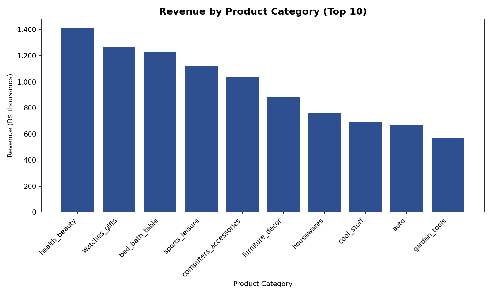
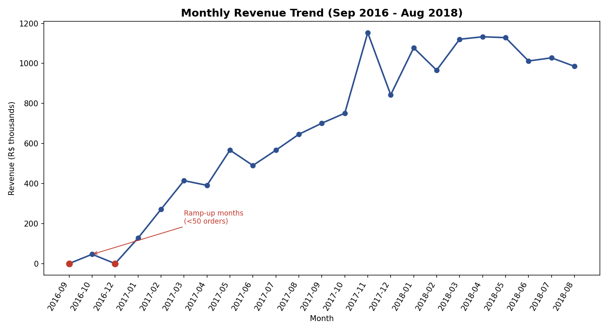
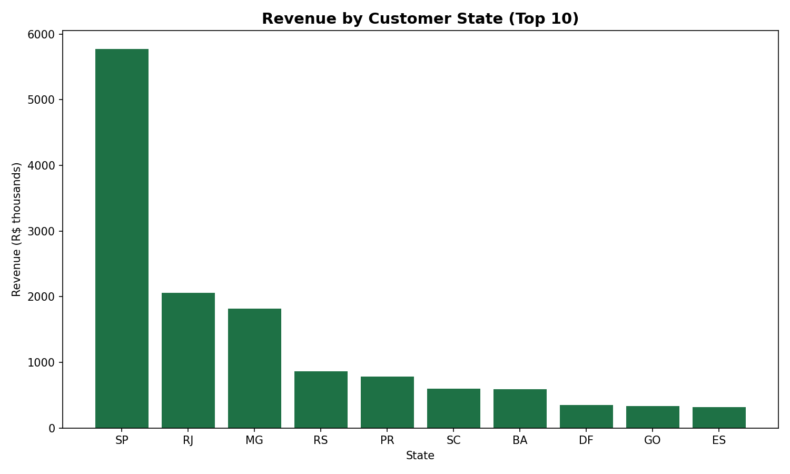
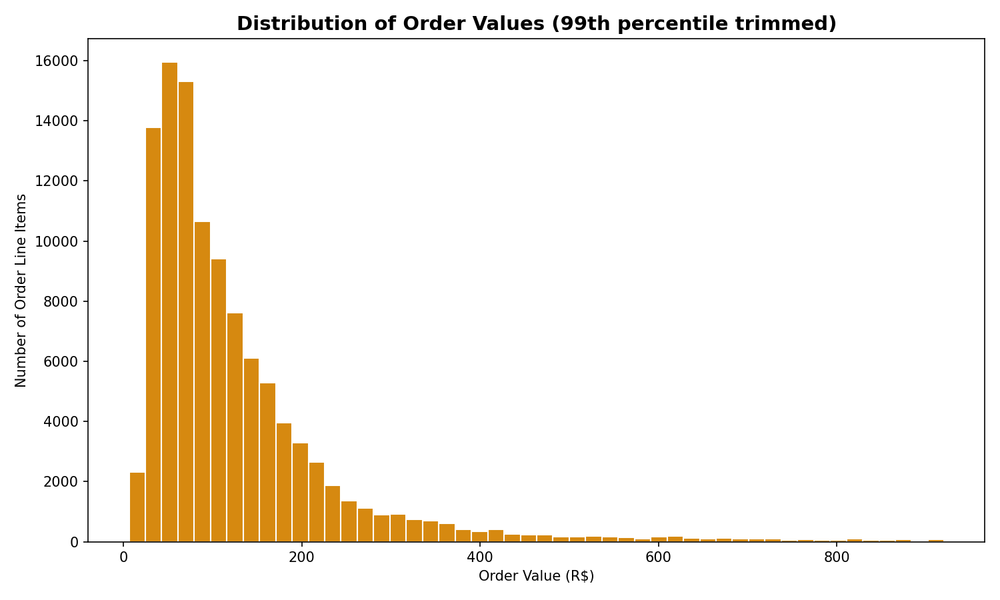
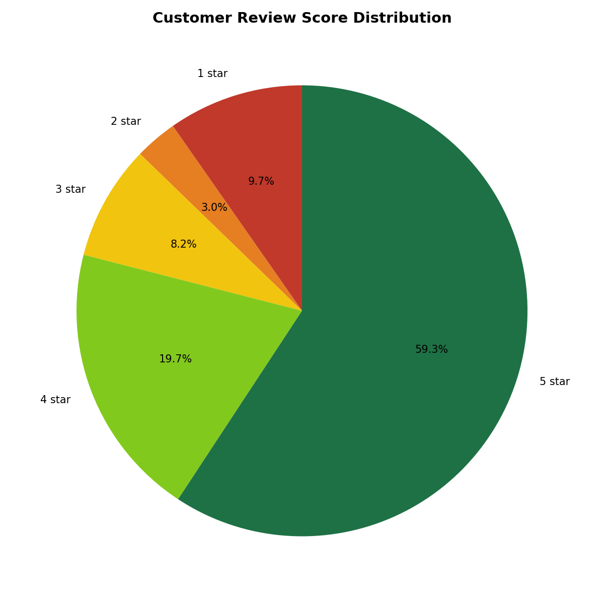
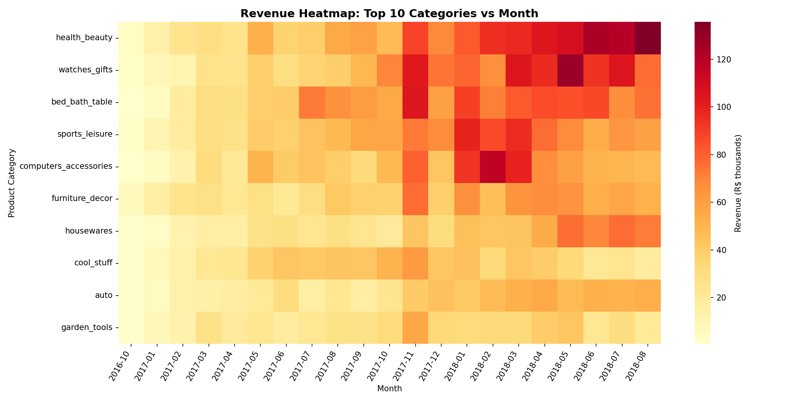

# E-Commerce Sales Analysis

## Project Overview
This repository contains a complete e-commerce sales analysis using the Olist Brazilian E-Commerce dataset. The work includes:

- Data cleaning and preparation
- Answers to the 5 required sales questions
- Six required visualizations
- A manager-ready dashboard in Excel
- A separate business insights report with recommendations

## 1. Data Cleaning

The notebook loads the following Olist CSV files from a `data/` folder placed next to the notebook:

- `olist_orders_dataset.csv`
- `olist_order_items_dataset.csv`
- `olist_products_dataset.csv`
- `olist_order_reviews_dataset.csv`
- `olist_customers_dataset.csv`
- `product_category_name_translation.csv`

Cleaning steps and decisions:

1. Loaded all source tables and confirmed row counts for each dataset.
2. Checked missing values and documented the action for each table.
   - Missing delivery/approval dates appear only for orders that were not completed.
   - Missing product categories were filled as `unknown_category` instead of dropping revenue rows.
   - Optional review text fields were left alone since they are not required for scoring.
3. Converted relevant fields to proper data types:
   - order timestamps to datetime
   - review scores to integer
   - price and freight values to float
4. Removed duplicate records where present:
   - duplicate order IDs in `orders`
   - duplicate items rows
   - duplicate products and reviews
   - duplicate customers
5. Kept only the most recent review per order to maintain one review row per order.
6. Translated product categories to English and merged all relevant tables into one frame.
7. Filtered the analysis to delivered orders only, since cancelled or incomplete orders do not represent real revenue.
8. Created key analysis fields:
   - `revenue = price + freight_value`
   - `order_month` from the purchase timestamp
9. Identified two low-volume ramp-up months (`2016-09` and `2016-12`) and excluded them from peak-month comparisons.

## 2. Sales Analysis — 5 Questions

### Q1: Which product category has the highest revenue?
- **Answer:** `Health & Beauty`
- This category leads revenue across the dataset and is the top contributor in the category revenue chart.

### Q2: Which month had peak sales?
- **Answer:** `November 2017`
- The monthly revenue trend chart shows a strong peak in November, consistent with a Black Friday effect.

### Q3: Which region performs best?
- **Answer:** `São Paulo (SP)`
- São Paulo contributes the highest revenue by state and is clearly the top-performing region.

### Q4: What is the average order value trend?
- **Answer:** The average order value remains relatively flat around `R$150–175` over the analysis period.
- Growth is driven by order volume rather than larger baskets.

### Q5: What is the customer review score distribution?
- **Answer:** The review score distribution is skewed toward positive ratings, with a strong share of 5-star reviews.
- At the same time, about `12.8%` of orders still receive 1–2 stars, showing a meaningful dissatisfaction segment.

## 3. Visualizations — 6 Required Charts

The notebook builds the following charts, each with titles and axis labels:

1. `chart1_revenue_by_category.png`
   - Bar chart showing revenue by product category.

   

2. `chart2_monthly_trend.png`
   - Line chart showing the monthly revenue trend from September 2016 to August 2018.

   

3. `chart3_regional_sales.png`
   - Bar chart showing revenue by customer state.

   

4. `chart4_order_value_histogram.png`
   - Histogram of order values (trimmed at the 99th percentile for readability).

   

5. `chart5_review_distribution.png`
   - Pie chart showing review score distribution.

   

6. `chart6_category_month_heatmap.png`
   - Heatmap showing revenue for the top categories across months.

   

## 4. Dashboard

A manager-friendly one-page summary dashboard is included in `Ecommerce_Sales_Dashboard.xlsx`.
It contains the key performance indicators (KPIs) that summarize the business quickly:

- Total revenue: `R$ 15,419,773.75`
- Total orders: `96,478`
- Top category: `Health & Beauty`
- Best month: `November 2017`

The dashboard is designed to support quick decisions by showing revenue trends, category performance, and regional strength.

## 5. Business Insights Report

A separate report with 5 numbered, recommendation-backed insights is available in `Business_Insights_Report.md`.
Each insight references a specific chart or finding and includes an actionable business recommendation.

## 6. Conclusion

This analysis provides a complete view of e-commerce performance for the Olist dataset. It identifies the top revenue category, the strongest month, the best-performing region, and key customer feedback patterns. The chart images, dashboard, and recommendation report together support business decisions on marketing, regional expansion, pricing, and delivery improvements.

